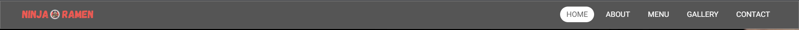
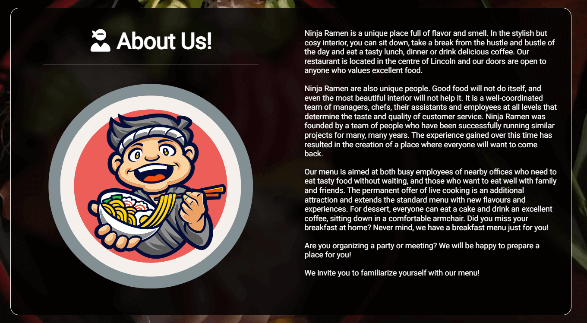
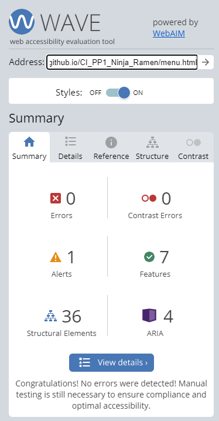
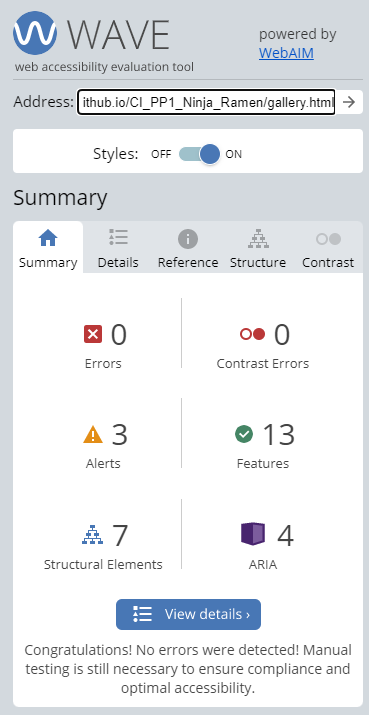
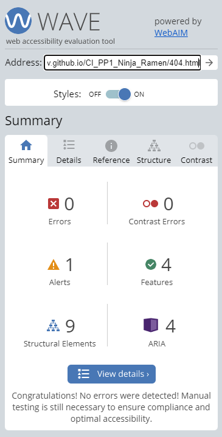
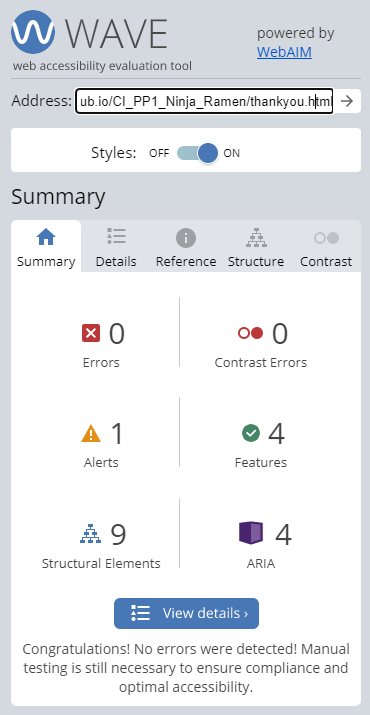
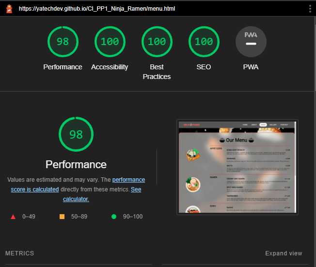
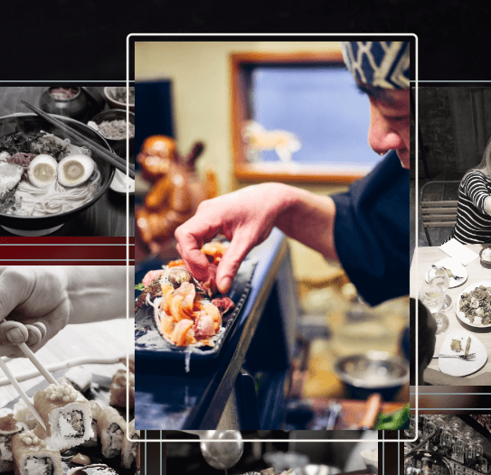

# Ninja Ramen
First project portfolio for Code Institute. A website for the imaginery Japanese restaurant based in Lincoln, UK.  
(Developer: Mateusz Smalarz aka YatechDev)

[Ninja Ramen - Live webpage](https://yatechdev.github.io/CI_PP1_Ninja_Ramen/) (Right click to open in new tab)

## Table of Content

1. [Project Goals](#project-goals)
    1. [User Goals](#user-goals)
    2. [Site Owner Goals](#site-owner-goals)
2. [User Experience](#user-experience)
    1. [Target Audience](#target-audience)
    2. [User Requirements and Expectations](#user-requirements-and-expectations)
    3. [User Stories](#user-stories)
3. [Design](#design)
    1. [Design Choices](#design-choices)
    2. [Fonts](#fonts)
    3. [Structure](#structure)
    4. [Wireframes](#wireframes)
4. [Technologies Used](#technologies-used)
    1. [Languages](#languages)
    2. [Frameworks & Tools](#frameworks-&-tools)
5. [Features](#features)
6. [Validation](#validation)
    1. [HTML Validation](#HTML-validation)
    2. [CSS Validation](#CSS-validation)
7. [Testing](#testing)
    1. [Accessibility](#accessibility)
    2. [Performance](#performance)
    3. [Device testing](#performing-tests-on-various-devices)
    4. [Browser compatibility](#browser-compatability)
    5. [Testing user stories](#testing-user-stories)
8. [Bugs](#Bugs)
9. [Deployment](#deployment)
10. [Credits](#credits)
11. [Acknowledgements](#acknowledgements)

## Project Goals

### User Goals
- Find a restaurant with oriental cuisine.
- Find a restaurant where you can eat good quality food.
- Find a place where you can spend time with family / friends in a nice atmosphere.
- Find a place where you can try something new / different.
- Find the restaurant localisation & contact details.
- Contact the restaurant through the page.
- Read about restaurant.
- Check the restaurant menu & prices.

### Site Owner Goals
- Promote the restaurant on the internet.
- Provide contact details for the users of the website.
- Provide the online form of contact.
- Show restaurant menu for existing and potential new customers.
- Provide links to the restaurant's social media.
- Make website responsive for mobile devices.
- Increase profit & amount of customers.

## User Experience

### Target Audience
- People who looking for a place to eat oriental cuisine.
- People who looking for a place to pend time with family / friends in a nice atmosphere.
- People who want to book a table for a meeting in a place with a high standard.
- People who are looking for a place to celebrate a birthday.
- People who want to organise parties & events.
- 
### User Requirements and Expectations
- A website that is quick to load.
- Responsive website for mobile devices.
- Easy navigation system.
- A website where you can quickly and easily find the essential information.
- Easy to find the restaurant's menu with prices.
- Easy way to contact the restaurant online.
- Find links for social media.
- Simple and interesting content.

### User Stories

#### First-time users
1. As a first time user, I want to know what kind of cuisine is in restaurant.
2. As a first time user, I want to easily navigate the page.
3. As a first time user, I want to know the restaurant menu & prices.
4. As a first time user, I want to know the story about the restaurant.
5. As a first time user, I want to know where restaurant is located.
6. As a first time user, I want to know restaurant opening time.
7. As a first time user, I want to know the restaurant contact details.

#### Returning visitor
8. As a returning user, I want to quickly check the menu.
9. As a returning user, I want to know about any changes in opening times.
10. As a returning user, I want to check the contact details.
11. As a returning user, I want to check if restaurant have any social media.
12. As a returning user, I want to contact the restaurant online.
13. As a returning user, I want to check the phone number for quick contact the restaurant.
14. As a returning user, I want to quickly find the restaurant menu.

### Site owner
15. As a site owner, I want to show what kind of cuisine is in our restaurant.
16. As a site owner, I want users to easily navigate the website.
17. As a site owner, I want users to easily find the restaurant menu.
18. As a site owner, I want to provide contact details for users.
19. As a site owner, I want to provide online contact form.
20. As a site owner, I want to provide links to restaurant's social media.
21. As a site owner, I want to show pictures of the restaurant for users.

## Design

### Design Choices
As a design for the website, I did not use ready-made colour palettes, and instead, I decided to choose themed photos as
the background for each of the subpages.  
Each of the main subpages has its photo, with a layer blurring the background and emphasizing the content of the page.  
In addition, the navbar and footer are in grey shades that match the style of the rest of the site.

Below is a list of photos selected for each subpage.

Home

About

Menu

Gallery

Contact

Pages "404" & "ThankYou" don't have specific photos, instead, they have a black background.

### Fonts
'Roboto' regular 400 - taken from Google Fonts and apply via @import method to CSS file.  
I chose this font because of its popularity, simplicity and ease of reading.

### Structure

The website is constructed in one of the most frequently chosen and user-friendly ways. At the top of the page, there is
a navigation bar with links to other subpages, below the main content of the page and a footer at the bottom.

The website consists of five main pages and two additional pages.

- Home
- About
- Menu
- Gallery
- Contact

and

- 404 page
- Thank You page

### Wireframes
This is the prototype of the project that may change during its development.

Home

About

Menu

Gallery

Contact

## Technologies Used

### Languages
- HTML 5
- CSS 3

### Frameworks & Tools
- Balsamiq (create wireframes for the project)
- GitHub (create, hold and deploy repository)
- Git (source code management)
- WebStorm (IDE use to build the website)
- Chrome DevTools (checking & testing the site)
- WC3 Validator (validation of HTML & CSS code)
- Webaim.org (accessibility & contrast checker)
- Am I Responsive (website mockup)
- Canva (images, logo & other graphic elements)
- Paint (images edit)
- Freeconvert.com (convert jpg to webp format)
- TinyPNG (compress images)
- Google Fonts (fonts)
- Font Awesome (icons)
- Favicon.io (favicon)
- Evernote (notes, screenshots)
- Grammarly (typography)

## Features
The website consists of 5 main subpages and an additional "404" and "thank you" pages.

### Navigation Bar

The navigation bar is present on all subpages of the website, it is easily noticeable, intuitive and easy to use. The
navigation bar highlights the selected page where the user is located.
On the left side, there is a logo that, when clicked, leads to the main page. The navigation bar is responsive to mobile
devices - it then turns into a common in-use "hamburger menu".

- User Stories covered: 2, 14, 16, 17

### Hero Section & Restaurant Goals

The section on the main page is a first eye-catcher. It contains a short description of the restaurant,
thanks to which the user learns what cuisine the restaurant has to offer.
In the section, we can see two buttons that lead to the menu of the restaurant and additional information about the
restaurant.
The section also includes logos and photo thumbnails for attention and additional visual effect.  

Immediately below the section, there are restaurant goals, which are quick to read and are designed to arouse the
curiosity and interest of the user to continue browsing the site and take advantage of the restaurant's offer.

- User Stories covered: 1, 8, 14, 15, 17

### Footer

Footer, like the navigation bar, is present on all subpages and is responsive to mobile devices. It contains links to
restaurant's profile on the most popular social media, opening hours, contact details and copyrights.  
Links to social media are shown as icons, making it easy to find a platform that interests the user.
The links open in a new browser tab, so the user stays on the restaurant's website.

- User Stories covered: 5, 6, 7, 9, 10, 11, 13, 18, 20

### About Us

The "about us" section gives the user a greater description of the restaurant, and a short history and encourages the
organization of meetings and events in the restaurant.

- User Stories covered: 1, 4, 5

### Menu

The section contains the restaurant's menu and is divided into categories. Each of the categories contains a drawing of
the dish, which is hidden on mobile devices to ensure greater comfort in viewing the offer.  
Each dish has a short description and price.

- User Stories covered: 1, 3, 8, 15

### Gallery & Video

A section where the user can see photos of both meals and the interior of the restaurant.
The photos are in grayscale, but when you hover over one of them, it zooms in and shows in full colour. This gives an
interesting visual effect to the user.  
Below is a short promotional video to encourage the user to take advantage of the restaurant's offer.

- User Stories covered: 1, 15, 21

### Contact Section

Section where you can find a contact form that allows you to freely contact the restaurant online.  
Next to the form, the user can find a map that shows exactly where the restaurant is located.

- User Stories covered: 12, 19

## Validation

### HTML Validation

I used "W3C Markup Validation Service" to validate the code.  
I validated each of the subpages and no error was found on any of them.

Home

About

Menu

Gallery

Contact

404

ThankYou

### CSS Validation

I used "W3C CSS Validation Service" to validate the CSS code.

I have performed two validations:

1. The Whole page showed errors and alerts related to imported CSS code from Font Awesome but showed no errors with my
   CSS.

Whole Page

2. During the second validation I loaded my CSS file and the program did not find any errors related to my code, it only
   suggested that the imported CSS sheet (google font) was not checked.

My CSS file

## Testing

### Accessibility

I used "The WAVE WebAIM web accessibility evaluation tool" to test the code for accessibility and the same error
appeared on each of the subpages.
The label for input has an icon in it for a "hamburger menu" purpose, and has no other content. The tool treats this as an
error.  
No other errors were detected on any of the subpages.

Home

About

Menu

Gallery

Contact

404

ThankYou

### Performance

To test the performance on the website, I used Google Lighthouse in Google Chrome Developer Tools.
The test was carried out on all subpages, both for computers and mobile devices.  
Below is a list of screenshots:

Home

Home - mobiles

About

About - mobiles

Menu

Menu - mobiles

Gallery

Gallery - mobiles

Contact

Contact - mobiles

404

404 - mobiles

ThankYou

ThankYou - mobiles

### Performing tests on various devices
The website was tested on devices such as:

- MSI Katana GF76 17.3"
- ASUS TUF Dash F15 15.6"
- iPhone 11 PRO
- iPhone XR
- Xiaomi Redmi Note 9
- Samsung Galaxy Tab A (landscape & portrait mode)

### Browser compatability
The website has been tested on the following browsers:
- Google Chrome
- Chromium
- Mozilla Firefox
- Opera
- Microsoft Edge
- Safari

### Testing user stories

1. As a first time user, I want to know what kind of cuisine is in restaurant.

| **Feature**                     | **Action**                          | **Expected Result**                                                                  | **Actual Result** |
|---------------------------------|-------------------------------------|--------------------------------------------------------------------------------------|-------------------|
| Hero Section & Restaurant Goals | First section displayed on the page | User can see straight away and read what type of cuisine he can expect in restaurant | PASS              |
| Menu                            | Check the menu                      | Find what type of food restaurant has to offer                                       | PASS              |
| Gallery                         | Click on the gallery                | User is able to see some examples of the meals                                       | PASS              |

Screenshots

## Bugs
1.

| **Bug**                                                  | **Fix**                                                                          |
|----------------------------------------------------------|----------------------------------------------------------------------------------|
| Font Awesome icons are not displaying on Safari browser. | Remove link for Font Awesome script, link css stylesheet and make local library. |

Tested on iPhone 11 PRO & iPhone XR

Before

After

2.

| **Bug**                                     | **Fix**                                             |
|---------------------------------------------|-----------------------------------------------------|
| Hovered images are covered by other images. | Set position for relative and use z-index property. |

Before

After

3.

| **Bug**                                            | **Fix**               |
|----------------------------------------------------|-----------------------|
| Navbar after scrolling is covered by page content. | Use z-index property. |

Before

After

4.

| **Bug**                                                       | **Fix**                                 |
|---------------------------------------------------------------|-----------------------------------------|
| Lost responsiveness of contact.html after changing html code. | Use correct class name in css document. |

Before

After

## Deployment
The website was deployed on GitHub by using following steps:
1. Login into GitHub and locate the repository - [CI_PP1_Ninja_Ramen](https://github.com/YatechDev/CI_PP1_Ninja_Ramen)
2. At the top of repository locate the "settings" button and click on it.
3. Now on the left sidebar find locate the "pages" button and click on it.
4. Under source heading click on the branch dropdown menu and select: master.
5. Click save.
6. You will receive link to your deployed repository like on the screen below.

Forking the GitHub repository:
1. Login into GitHub and locate the repository - [CI_PP1_Ninja_Ramen](https://github.com/YatechDev/CI_PP1_Ninja_Ramen)
2. At the top of repository in right corner locate the "fork" button and click on it.
3. Choose where you want to save your forked repository.

## Credits
1. [CI TEMPLATE](https://github.com/Code-Institute-Org/gitpod-full-template) - This repository was created using the template proposed by Code Institute
2. [Canva](https://www.canva.com/) - All photos and graphics are from Canva and are used under a license I have. I made most of the graphic elements
   myself using this program.
3. [JetBrains](https://www.jetbrains.com/webstorm/) - I use their software - WebStorm - as my main IDE.
4. [Animated Label - Tutorial](https://www.youtube.com/watch?v=524ycUqs3f0) - This tutorial taught me how to make
   animated labels for form input. I partially modified the code, although the idea is taken from this tutorial.
5. [Pretty Sticky](https://codepen.io/BurmesePotato/pen/qBbqpNB) - This code inspired me to create the menu section. It
   has been modified in large part by me, although the idea and the skeleton come from here.
6. [Code Institute](https://codeinstitute.net/) - As the main source of my knowledge.
7. [ZTM](https://zerotomastery.io/), [CodeCademy](https://www.codecademy.com/), [EduWeb](https://eduweb.pl/)
   , [Strefa Kursow](https://strefakursow.pl/) - As additional places where I often do additional courses and enrich my
   knowledge.

## Acknowledgements