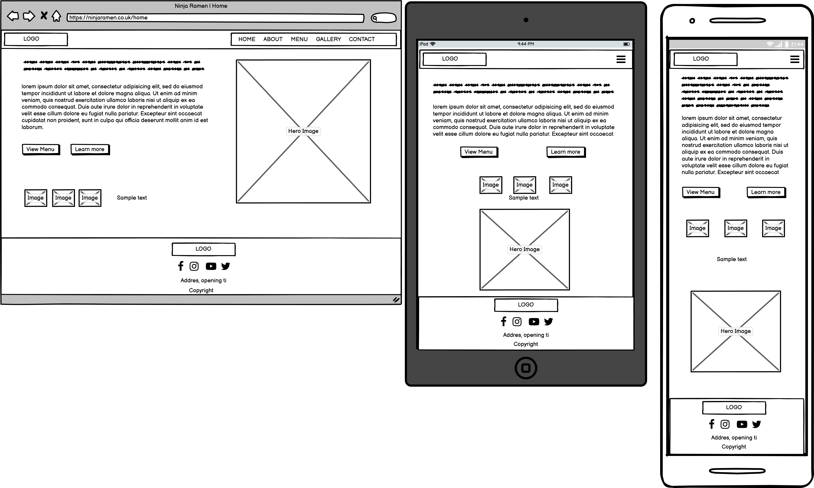
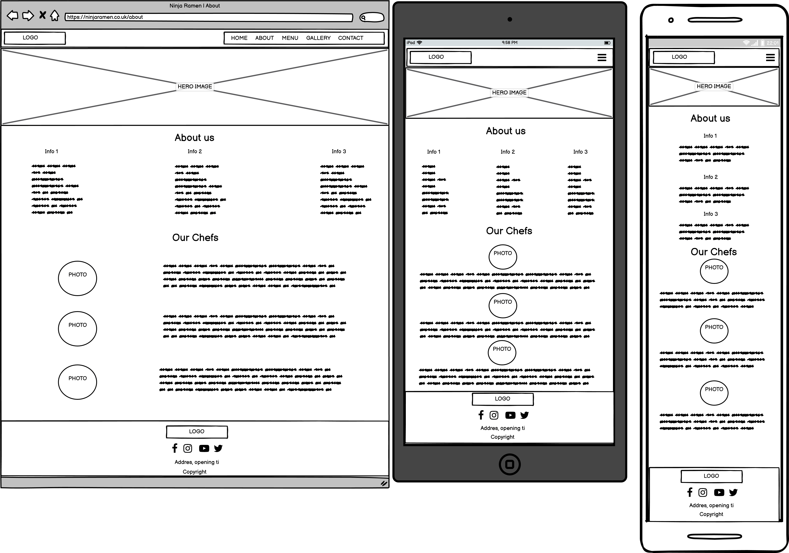
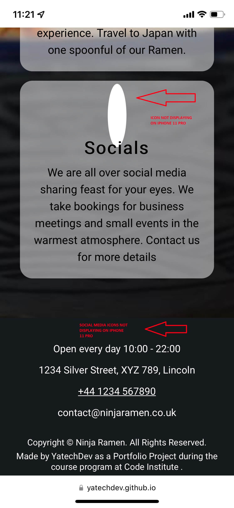
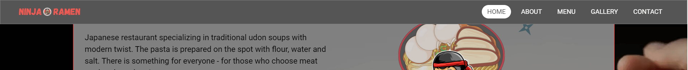

# Ninja Ramen
First project portfolio for Code Institute. A website for the imaginery Japanese restaurant based in Lincoln, UK.  
(Developer: Mateusz Smalarz aka YatechDev)

[Ninja Ramen - Live webpage](https://yatechdev.github.io/CI_PP1_Ninja_Ramen/) (Right click to open in new tab)

## Table of Content

1. [Project Goals](#project-goals)
    1. [User Goals](#user-goals)
    2. [Site Owner Goals](#site-owner-goals)
2. [User Experience](#user-experience)
    1. [Target Audience](#target-audience)
    2. [User Requirements and Expectations](#user-requirements-and-expectations)
    3. [User Stories](#user-stories)
3. [Design](#design)
    1. [Design Choices](#design-choices)
    2. [Colour](#colour)
    3. [Fonts](#fonts)
    4. [Structure](#structure)
    5. [Wireframes](#wireframes)
4. [Technologies Used](#technologies-used)
    1. [Languages](#languages)
    2. [Frameworks & Tools](#frameworks-&-tools)
5. [Features](#features)
6. [Validation](#validation)
    1. [HTML Validation](#HTML-validation)
    2. [CSS Validation](#CSS-validation)
7. [Testing](#testing)
    1. [Accessibility](#accessibility)
    2. [Performance](#performance)
    3. [Device testing](#performing-tests-on-various-devices)
    4. [Browser compatibility](#browser-compatability)
    5. [Testing user stories](#testing-user-stories)
8. [Bugs](#Bugs)
9. [Deployment](#deployment)
10. [Credits](#credits)
11. [Acknowledgements](#acknowledgements)

## Project Goals

### User Goals
- Find a restaurant with oriental cuisine.
- Find a restaurant where you can eat good quality food.
- Find a place where you can spend time with family / friends in a nice atmosphere.
- Find a place where you can try something new / different.
- Find the restaurant localisation & contact details.
- Contact the restaurant through the page.
- Read about restaurant.
- Check the restaurant menu & prices.

### Site Owner Goals
- Promote the restaurant on the internet.
- Provide contact details for the users of the website.
- Provide the online form of contact.
- Show restaurant menu for existing and potential new customers.
- Provide links to the restaurant's social media.
- Make website responsive for mobile devices.
- Increase profit & amount of customers.

## User Experience

### Target Audience
- People who looking for a place to eat oriental cuisine.
- People who looking for a place to pend time with family / friends in a nice atmosphere.
- People who want to book a table for a meeting in a place with a high standard.
- People who are looking for a place to celebrate a birthday.
- People who want to organise parties & events.
- 
### User Requirements and Expectations
- A website that is quick to load.
- Responsive website for mobile devices.
- Easy navigation system.
- A website where you can quickly and easily find the essential information.
- Easy to find the restaurant's menu with prices.
- Easy way to contact the restaurant online.
- Find links for social media.
- Simple and interesting content.

### User Stories

#### First-time users
1. As a first time user, I want to know what kind of cuisine is in restaurant.
2. As a first time user, I want to know the restaurant menu & prices.
3. As a first time user, I want to know the story about the restaurant.
4. As a first time user, I want to know where restaurant is located.
5. As a first time user, I want to know restaurant opening time.
6. As a first time user, I want to know the restaurant contact details.

#### Returning visitor
7. As a returning user, I want to quickly check the menu.
8. As a returning user, I want to know about any changes in opening times.
9. As a returning user, I want to check the contact details.
10. As a returning user, I want to check if restaurant have any social media.
11. As a returning user, I want to contact the restaurant online.
12. As a returning user, I want to check the phone number for quick contact the restaurant.
13. As a returning user, I want to check if restaurant create any new offers.

### Site owner
14. As a site owner, I want to show what kind of cuisine is in our restaurant.
15. As a site owner, I want users to easily navigate the website.
16. As a site owner, I want users to easily find the restaurant menu.
17. As a site owner, I want to provide contact details for users.
18. As a site owner, I want to provide online contact form.
19. As a site owner, I want to provide links to restaurant's social media.
20. As a site owner, I want to show pictures of the restaurant for users.

## Design

### Design Choices

### Colour

### Fonts

### Structure

### Wireframes
This is the prototype of the project that may change during its development.

Home

About

Menu

Gallery

Contact

## Technologies Used

### Languages
- HTML 5
- CSS 3

### Frameworks & Tools
- Balsamiq (create wireframes for the project)
- GitHub (create, hold and deploy repository)
- Git (source code management)
- WebStorm (IDE use to build the website)
- Chrome DevTools (checking & testing the site)
- WC3 Validator (validation of HTML & CSS code)
- Webaim.org (accessibility & contrast checker)
- Am I Responsive (website mockup)
- Canva (images, logo & other graphic elements)
- Paint (images edit)
- Freeconvert.com (convert jpg to webp format)
- TinyPNG (compress images)
- Google Fonts (fonts)
- Font Awesome (icons)
- Favicon.io (favicon)
- Evernote (notes, screenshots)
- Grammarly (typography)

## Features

## Validation

### HTML Validation

### CSS Validation

## Testing

### Accessibility

### Performance

### Performing tests on various devices

### Browser compatability

### Testing user stories

## Bugs
1.

| **Bug**                                                  | **Fix**                                                                          |
|----------------------------------------------------------|----------------------------------------------------------------------------------|
| Font Awesome icons are not displaying on Safari browser. | Remove link for Font Awesome script, link css stylesheet and make local library. |

Tested on iPhone 11 PRO & iPhone XR

Before

After

2.

| **Bug**                                     | **Fix**                                             |
|---------------------------------------------|-----------------------------------------------------|
| Hovered images are covered by other images. | Set position for relative and use z-index property. |

Before

After

3.

| **Bug**                                            | **Fix**               |
|----------------------------------------------------|-----------------------|
| Navbar after scrolling is covered by page content. | Use z-index property. |

Before

After

4.

| **Bug**                                                       | **Fix**                                 |
|---------------------------------------------------------------|-----------------------------------------|
| Lost responsiveness of contact.html after changing html code. | Use correct class name in css document. |

Before

After

## Deployment

## Credits

## Acknowledgements